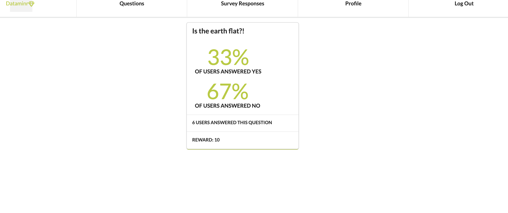

Welcome to Dataminr! 

Dataminr is a social interaction app that allows users to create and answer one quesstion surveys, and view the results of those surveys. 

Installation:
- Fork and clone this repository
- "bundle install" if necessary 
- [Open Dataminr Backend](https://github.com/gabechaz/dataminr-backend)
- Run "rails db:migrate" & "rails db:seed"
- Run "rails s" in the terminal 
- Open the Hangr Frontend
- Run "npm start" 

Navigating the app:
- Sign Up/Log in
- 

- Log out by selecting the option in the navbar
Created by Claire DeBoer and Gabriel Chazanov 